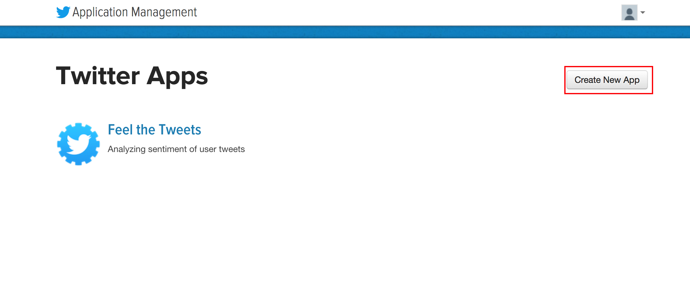
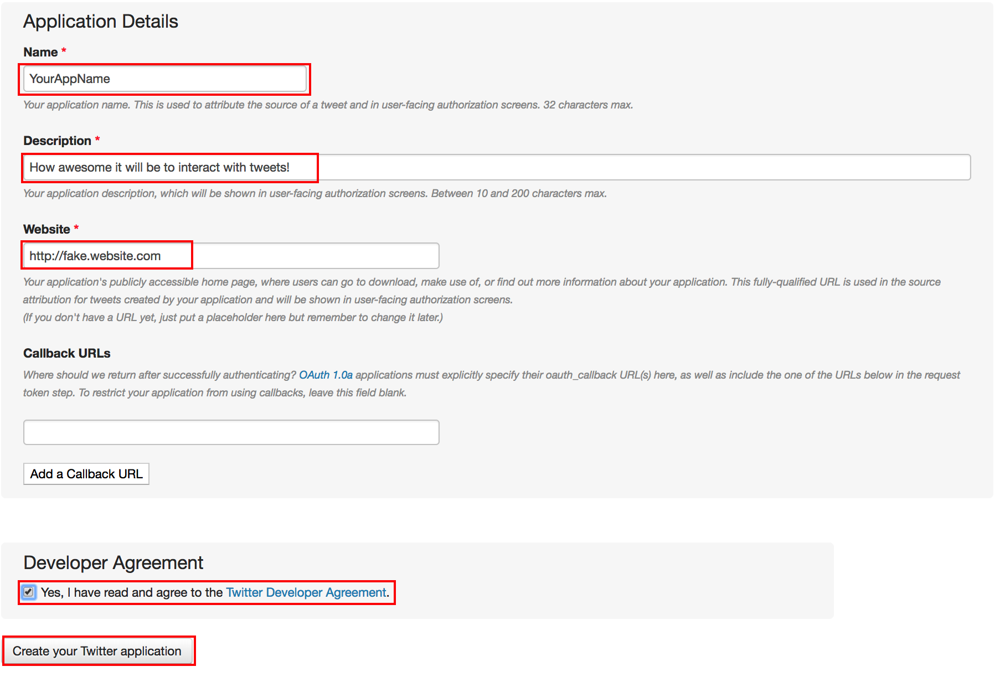
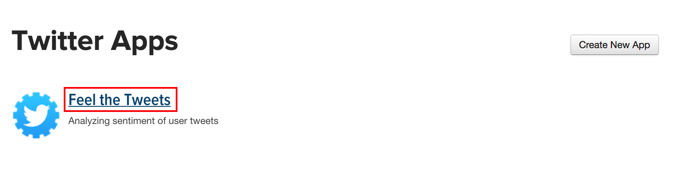
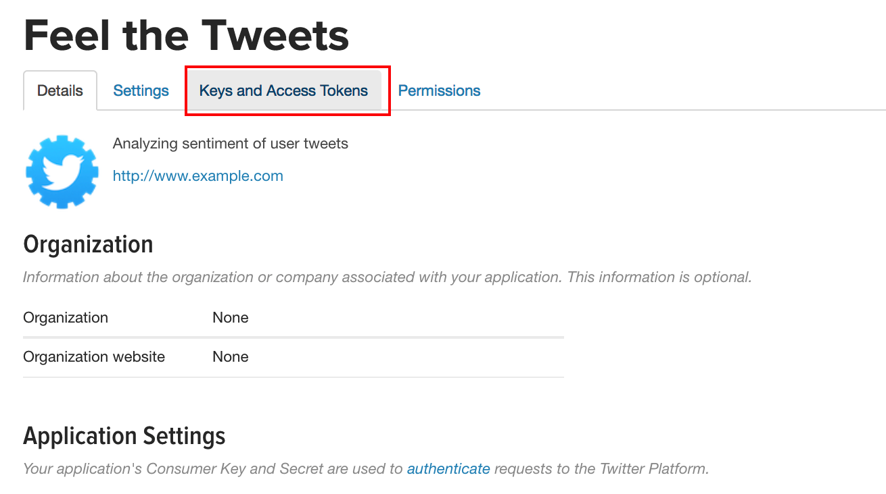
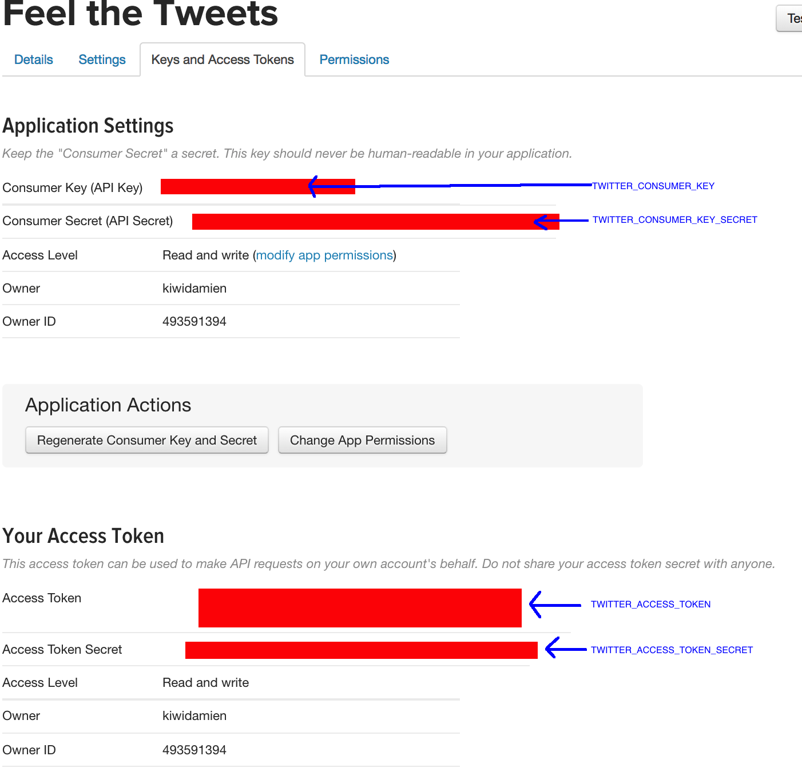
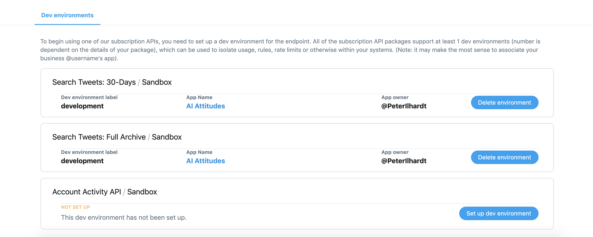

## Getting Credentials for the Twitter API
---

1. Start by going to the [Twitter Developer homepage](http://developer.twitter.com/). If you don't have a Twitter Developer account yet, sign up for one here.

> *Note*: In order to make a Developer Account, you must already have a basic Twitter account. If you don't have one already, sign up for a basic Twitter account on the [Twitter homepage](http://twitter.com) before making a Developer account.

2. Create a new application.

3. Fill out the information about your application, specifically the **Name**, **Description**, and **Website**. Then check the box and click the "Create your Twitter application" button. For the website, Twitter does allow you to put in a placeholder website if you want.

4. Select the application you just created.

5. Click on the tab "Keys and Access Tokens".

6. Generate new 'Consumer' and 'Access Token' keys, and copy the 4 keys to a file called `twitter_credentials.py`. Store the keys in a dictionary.

| Twitter Field | Dictionary Key |
|---|---|
| Consumer Key (API Key) | "TWITTER_CONSUMER_KEY" |
| Consumer Secret (API Secret) | "TWITTER_CONSUMER_KEY_SECRET" |
| Access Token | "TWITTER_ACCESS_TOKEN" |
| Access Token Secret | "TWITTER_ACCESS_TOKEN_SECRET" |

7. *Optional*: To be able to access older Tweets through the Premium APIs ('30-Days' and 'Full Archive'), go to [your Dashboard](https://developer.twitter.com/en/dashboard) and click 'set up a dev environment' for the corresponding API. Click 'Set up dev environment' and assign a 'label' to the environment as well as the associated app. This is the name you will use when connecting to the Premium API through that app.
 
